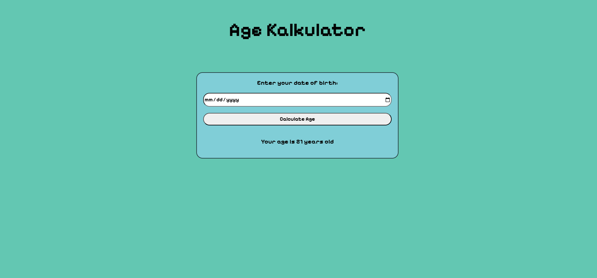

# 🎂 Age Calculator

Simple web application to calculate your age based on your date of birth.

This project is part of my **JavaScript learning journey** where I practice working with:
- DOM manipulation
- Date objects in JavaScript
- User input handling
- Basic UI styling

---

## Preview

---

## ✨ Features

- 📅 Input date of birth
- ⚡ Calculate age instantly
- 🧠 Uses JavaScript Date object
- 🎨 Simple and clean UI
- 📱 Works in any modern browser

---

## 🛠 Tech Stack

- HTML
- CSS
- JavaScript (Vanilla JS)

---